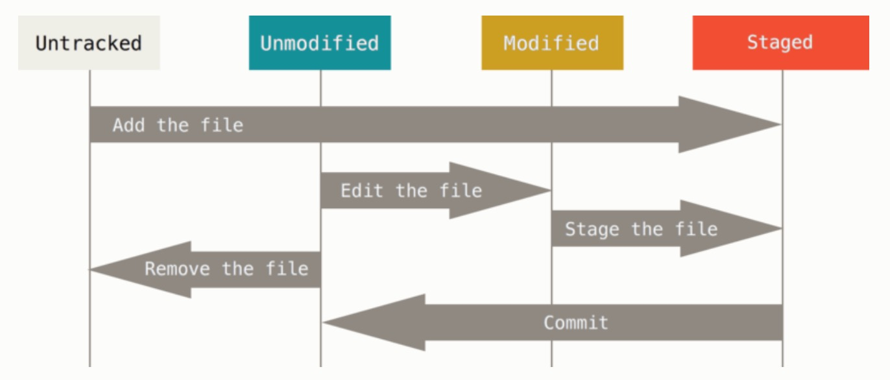

[notes](https://git-scm.com/book/zh/v2/Git-%E5%9F%BA%E7%A1%80-%E8%AE%B0%E5%BD%95%E6%AF%8F%E6%AC%A1%E6%9B%B4%E6%96%B0%E5%88%B0%E4%BB%93%E5%BA%93)

查看所有branch:

```
git branch -a
```

新建branch:

```
git checkout -b new_branch
```

切换branch:

```
git checkout new_branch
```

指定本地与远端对应的branch(同名的不需要指定，此映射只在pull --rebase时起作用)

```
git pull --set-upstream-to=origin/master new_branch
```

将自己本地branch的内容合并到本地master中（需先将更新内容add并commit在自己branch中）（此时已在master branch中）:

```
git merge new_branch
```

上传自己更新的部分到master，这是需要小心的一步，因为已在本地master，不需要特别指明远端的branch:

```
git push
```

删除远端branch：

```
git push origin --delete case_approve
```

pull后如果有冲突需要解冲突，然后继续操作：

```
git rebase --continue
```
