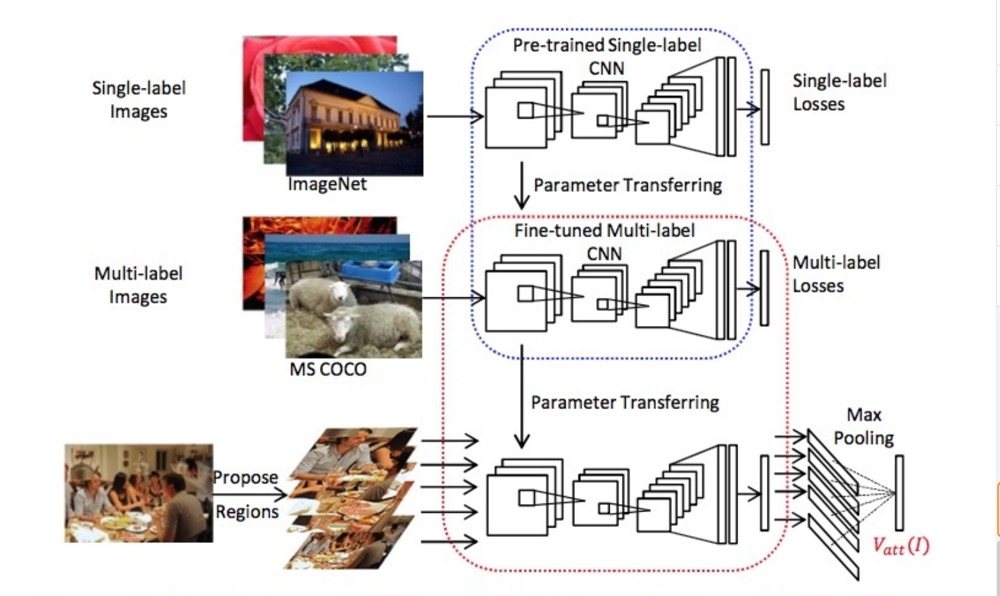
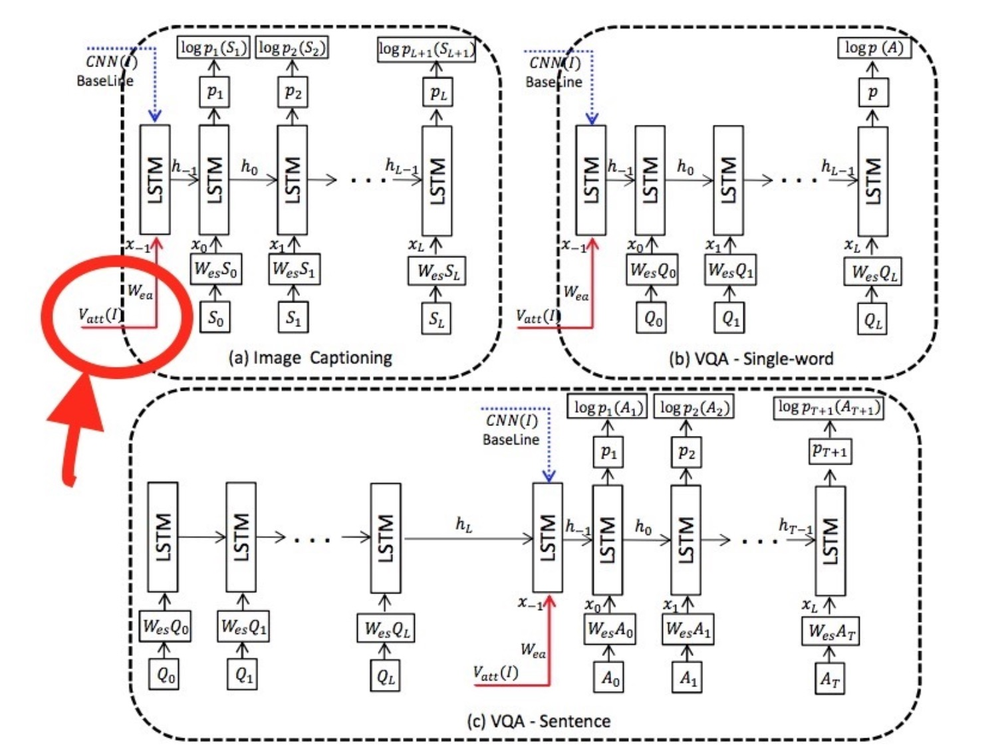

## Image Caption 图像描述

Image Caption的基本结构为Encoder-Decoder两部分。

这个基本结构可以完成输入与输出不等长的问题，比如机器翻译和图像描述。
w为输入的单词序列，y为输出，它们都是独热编码的单词，为1*D向量（D为单词表长度）。RNN隐层状态用h表示。在实际过程中，我们往往是将w转换为对应的word embedding形式的x，再输入RNN。hn包含了原始输入中所有有效信息。Decoder中的每一步，都会用这个信息进行解码。

###《Baby Talk》《Every picture tell a story》

它们主要利用图像处理的一些算子提取出图像的特征，经过SVM分类等得到图像中可能存在的目标object。根据提取出的object以及它们的属性，利用CRF或者一些认为制定的规则来恢复成对图像的描述。

现今的做法是，用CNN编码图像（机器翻译是用RNN编码）生成隐层变量，再利用解码器RNN读入隐层变量，逐步生成目标文字。

机器翻译decoder = 看图说话decoder

### Google: Show and tell: A Neural Image Caption Generator (2015)
> Inception + LSTM

Google团队用Incetion中softmax前一层的数据作为图像编码后的特征，传入LSTM（可能需要乘以特定维度的矩阵来转换维度）。

### 李飞飞: Neural Talk (2015)
> VGG + RNN

在接下来几年MSCOCO的leader board中，几乎都是这种框架拿第一。它的缺点：
1. 图像特征仅仅在开始的时候以bias的形式传入RNN
2. 只关注了全局特征
3. 模型在学习到了一种模板后再往里面进行填词

### Show attend and tell (cvpr 2016)

解决了1，2
之前的show and tell模型将输入序列编译成语义特征hn再解码，但是因为hn的长度限制，会影响长句的翻译精度。而show attend and tell提出了一种attention机制，不再使用统一的语义特征，而让Decoder在输入序列中**自由选取**需要的特征，大大提高了Encoder-Decoder模型性能。它具体李永乐CNN的空间特性，给图片的不同位置都提取一个特征，有了含位置信息的特征，Decoder在解码时拥有在这196个位置特征中选择的能力，这就是attention机制。

不同于以往采用全连接层作为图像特征，这次是直接使用卷积层conv5_3(第5个卷积block里面的第3个卷积层)作为特征。特征图大小通常为7\*7\*512。每个时刻传入LSTM的是上一时刻的状态c，h以及加权过后的卷积层特征。attention在这里的作用就是加权，对应不同的加权方式，分了两种。

不再使用全连接层代表图像，而是卷积层a的加权得来的z来代表不同时刻的图像。

### What Value Do Explicit High Level Concept Have in Vision to Language Problems?

之前可能存在的问题：
> - CNN提取出的特征图虽然很适合图像问题，但作为输入直接衔接到翻译问题中合适吗？
> - CNN的输出要怎么加入到RNN中才能更好的使图像中的注意力信息被文本化呢？
> - 多次输入效果真的不如单次好吗？如果多次输入不同呢？
> - RNN对长句子的遗忘问题怎么解决？

这篇文章主要解决了第一个问题。换句话说，如何处理特征图才能更具有高层语义特征？
用attribute vector进行finetune，用detections进行预测再综合输出，得到具有较高层语义信息的RNN输入。根据原文的流程图，模型可以分成三个演化过程：
##### 1. Pretrained VGG
##### 2. Finetune on MSCOCO to make it a semantic model
- Attribute Vector

> 使提取出来的特征具有语义信息，就是让特征图和单词句子挂钩。本模型使用了attribute vector。在训练集中的标注语句中提取了最常出现（至少5次）的256个词作为最具代表性的属性，这些词可以是任何词性，但是不区分时态和单复数（因为词较少）

- Finetune

> 将pretrained VGG最后输出改成256D的，进行多标签任务的分类（因为一个图片可能对应好几个属性）进行微调。这里对FC层使用xavier初始化，不同的层learning rate策略不同，并且使用element wise logistic loss function而不是MSE。在这之后，每张图经过网络之后输出的就已经是语义属性了。

##### 3. Using a detector
> 如果一张图只过一次网络，语义可能不完备。所以，要先做image detection，把所有BBs都过一遍，再结合起来，更细的粒度可能带来更好的结果。为了computational efficiency，在经过检测网络后，将BBs聚类成m个，再取每一类IOU最大的k个框，加上原图一共 m\*k+1 个BBs。这样会出现 m\*k+1 个预测得到的attribute vector，对每一个属性取最大值做max pooling得到一个vector就是原文中的Vatt(I)了，这个向量就是要输入到RNN中的。

值得关注的一点是，初次输入使用的 Wea\*Vatt(I)，也就是多了一个参数矩阵Wea，让模型自己学习。模型变得越来越“软”了，不过这个趋势也让参数越来越多，模型越来越复杂。

实验证明，Vatt(I)代替CNN(I)可以大幅度提升模型效果。

### knowing when to look

针对问题1，提出了一种自适应性的attention机制，是的模型可以自己决定生成单词的时候是根据先验知识（模板）还是根据图像中区域。整体思路如下：

与show and tell最主要不同的在于它attention机制：

利用ht而不是ht-1来决定看哪里，同时认为ct是ht的残差结构

[knowing when to look](https://blog.csdn.net/sinat_26253653/article/details/79416234)

### SCA-CNN

之前的工作都基于RNN，而CNN也不可忽略。

文章主要利用卷积层不同通道做attention，同时还利用了spatial attention机制：

由于卷积层不同通道所代表的信息不一样，比如图1中的cake经过卷积之后，并不是在所有卷积通道中都有响应，而是在特定的通道中出现了。提取出这些特定的通道，然后用spatial attention来处理图2得到最后的特征图。直观的角度来说，选取通道是决定看什么，spatial attention则是决定看哪里。最后得到的X显然比V的特征更具有纯粹性和代表性。

### Neural baby talk

使用了object detection，首先提取出图像中可能的物体，再进行描述生成。

受到基于句子模板填充的 baby talk 的启发，2018年出现了一种基于模板生成和填槽的image caption方法。其主要思想是将产生句子中的词语分为实体词和非实体词两个词表，句子模板由一个语言模型获得，其词语来自非实体词表。实体词表由目标检测方法直接由图像中获得，再用于填充句子模板中的空槽，形成一个句子。

这种方法开创性的使用神经网络来提取句子模板，从而解决了传统基于模板填充的方法缺乏多样性输入的问题。（不过对于我做的东西，可能不需要这种多样性）

### bottom-up and top-down (cvpr 2018)

同样使用了object detection，首先提取出图像中可能的物体，再进行描述生成。

很早以前的做法所获得图像描述往往都是和图像很相关，但是不流畅。而利用深度学习之后，生成的描述变得越来越流畅，但是相关性却大打折扣。

### Mind's Eye: A Recurrent Visual Representation for Image Caption Generation

这个有意思，它不仅能将图像特征翻译为文字，还能反过来从文字得到图像特征，此外还顺带提升了性能。
待学习。

### From Captions to Visual Concepts and Back (2015)

与 show and tell 同时期，都参加了微软的 Image Caption 比赛，两者并列第一。它不属于传统的Encoder-Decoder架构，而是采用了传统的语言建模方式。

### Skeleton-Attribute decoder 解码器 (2017)

这是解码端的改进。它由一个Skel-LSTM和一个Attr-LSTM构成，其中前者使用CNN提取出的图像特征获取一个主干句子，再使用后者作为每一个主干句子的词语获得一系列属性词，再将两部分词语合成最终的caption。

### Learning to Generate Stylised Image Captions Using Unaligned Text (cvpr 2018)

为了获得风格化的image caption结果，这篇文章使用了两个解码器，第一个称为term generator,使用CNN图像特征作为输入，通过GRU获得一系列基本语义对，由词语-属性组成。其后再将term generator获取的基本语义输入language generator，产生最后的输出。其中language generator用双向GRU编码按顺序排列的基本语义，再使用新的GRU进行解码。

这个模型感觉是把之前的句子模板调转，通过实体词之间补充非实体词，来形成完整的句子。

### Stack Caption

主要创新点在于使用一个粗粒度的解码器和多个细粒度的解码器，其中粗粒度解码器接受图像特征作为输入，形成其描述结果。接下来在每一个阶段都有一个细粒度的解码器进行更精细的解码，其输入来自上一阶段解码器的输出结果和图像特征，并使用attention机制，从而使得细粒度解码器在每一阶段对粗粒度产生结果的不同方面进行扩展，最终获得较详细的结果。

这些关于解码器的工作说明在解码段使用层级的或切分的解码思路可以显著提高image caption的效果，这样的解码思路也较为复合人类的思维模式，可解释性较强。

### Convolutional Image Caption (cvpr 2018)

这篇文章的方向完全不同于其它文章，它激进地使用Masked CNN

### 复现

[Image Caption图像描述原理简介及实现](https://blog.csdn.net/xiaxuesong666/article/details/79176572)

