# Design Twitter

> Scenario, Service, Storage, Scale

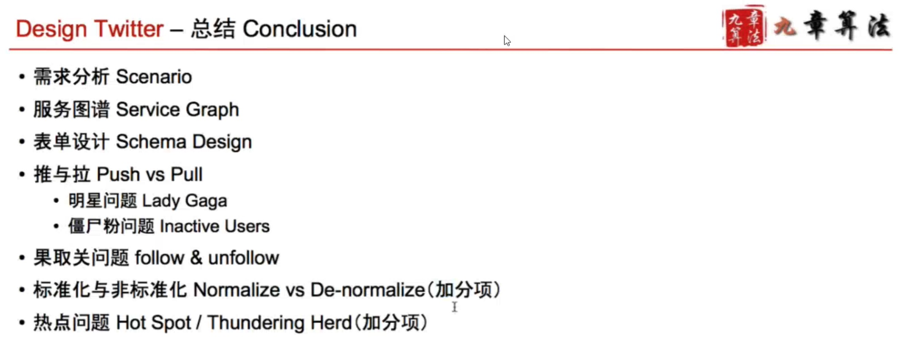

> 提前先问要求。现在想到的问的主要的问题：要什么功能，大概多少用户

- QPS: queries per second

> read QPS

> write QPS

- DAU: daily avg user


Peak Concurrent User / Avg Concurrent User 一般在 2 ~ 9

> 一般数据的估算方法：

DAU ---> MAU

DAU ---> qps ---> peak qps --->

SOA: Service Oriented Architecture 面向服务的架构设计

#### 将大系统拆分为小服务：

1. User Service (Register, Login)
2. Tweet Service (Post a tweet, News feed, Timeline)
3. Media Service (Upload image, Upload video)
4. Friendship Service (Follow, Unfollow)

#### Storage

1. Select: 为每个Service选择存储结构
2. Schema: 细化表结构

分类：

1. SQL Database 关系型数据库 (user table)
2. NoSQL Database 非关系型数据库 (tweets, social graph(followers))
3. File System 文件系统 (media files)

> 数据库用到了文件系统。数据库里的数据还是存储在文件系统中的。文件系统更底层

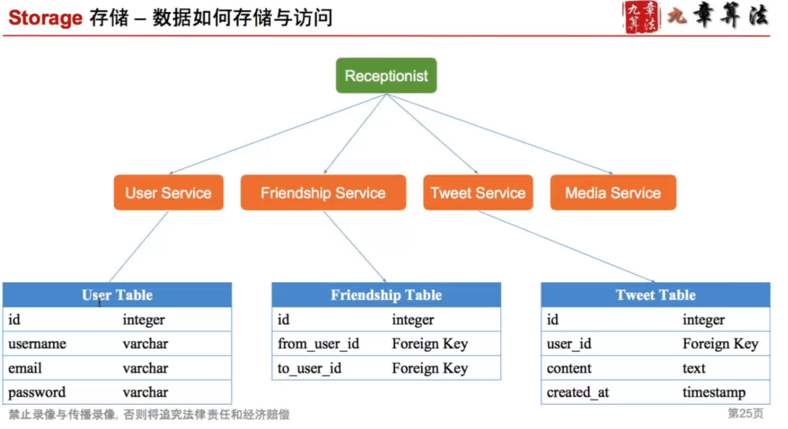

> I/O时间一般比较大， 系统设计的速度瓶颈在于请求次数

pull model:

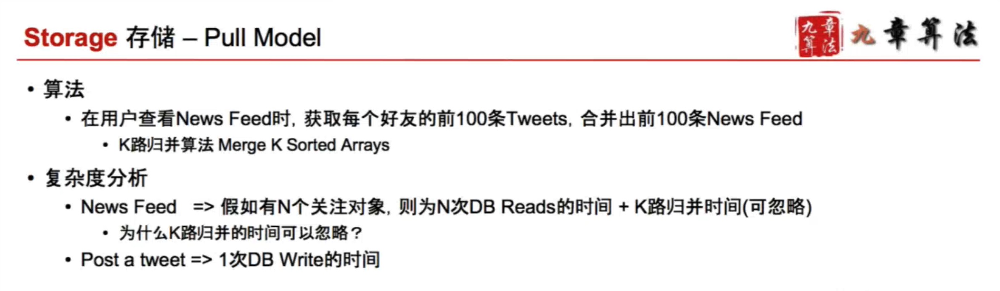

push model:

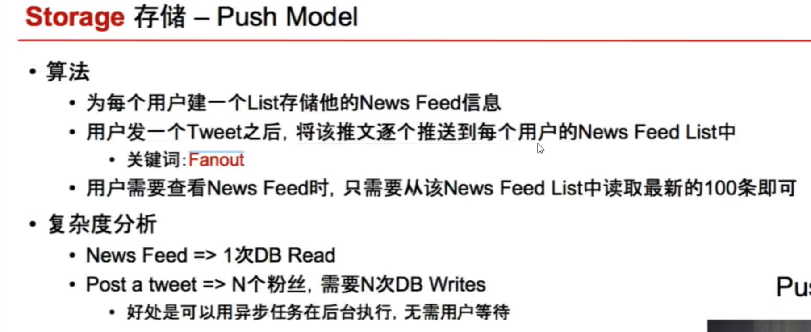

> fanout

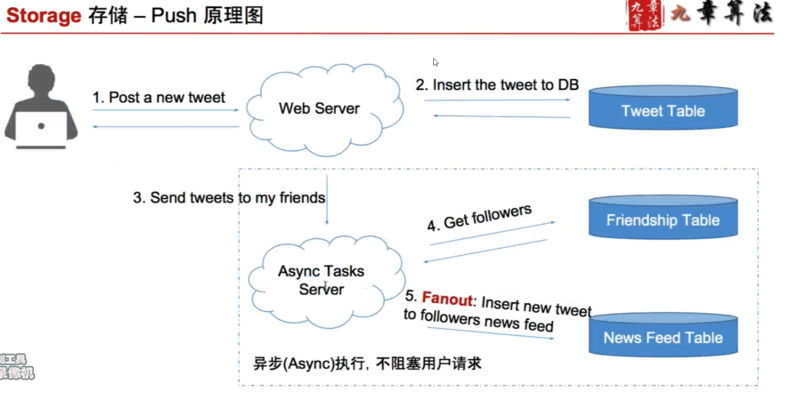

pull的问题：I/O 慢
 
push的问题：
 
> 1. lady gaga发个推，要更新的东西太多
> 2. 不活跃用户会浪费资源。你更新了他的news feed，人家根本不看

解决pull的缺陷：

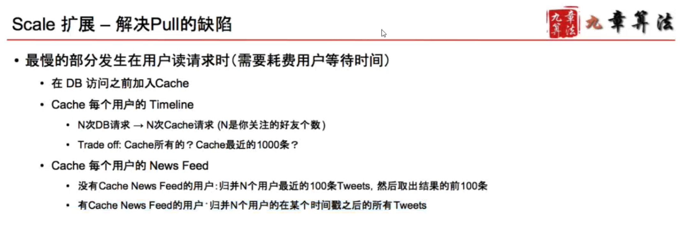

Memcached QPS / Mysql QPS 约为 100 ~ 1000

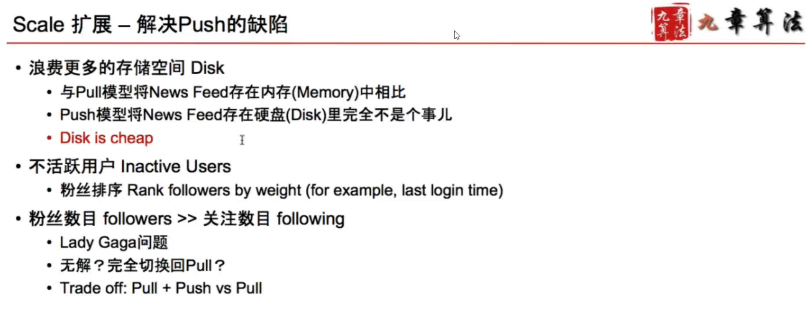

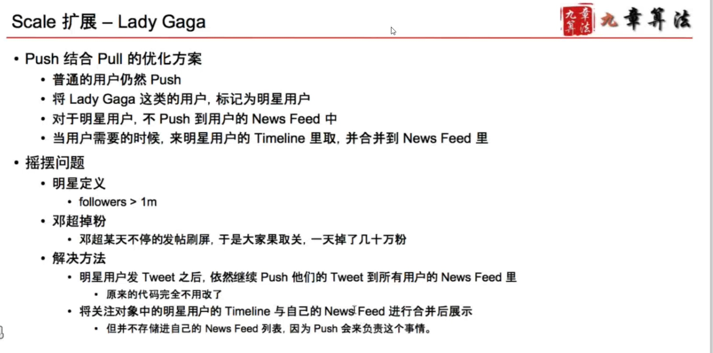

- when push:

> - 资源少
> - 用户发帖不多
> - 实时性要求不高
> - 双向好友

- when pull:

> - 资源多
> - 用户发帖多
> - 实时性要求高
> - 单向好友（关注）

关注和取关问题：

follow 或 unfollow 之后，要异步地将他的timeline 添加到你的news feed / 从你的news feed 中删除

> 异步。要确保用户第一时间能够感受到“我确实已经关注/取关他了”，而news feed 不一定要同一时间做完，可能会有一点延迟

- Likes 问题

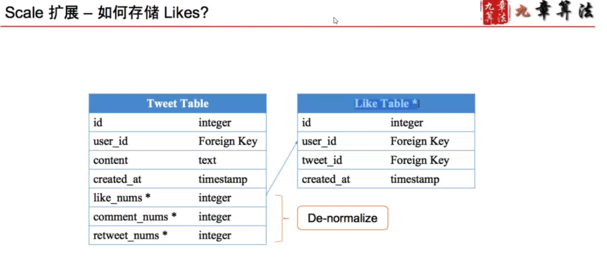

> select count(*) 这个操作很慢

> 所以要de-normalize: 把需要count(*) 的赞数，评论数，转发数，另外存一份

> 如果明星发了某一条爆炸推特，这条推特会有很多赞，评论和转发，那么load balancer, sharding, consistent hashing 对这个都不管用，因为是同一条推特


# Database

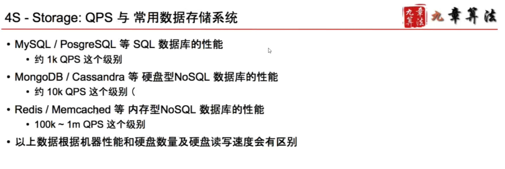

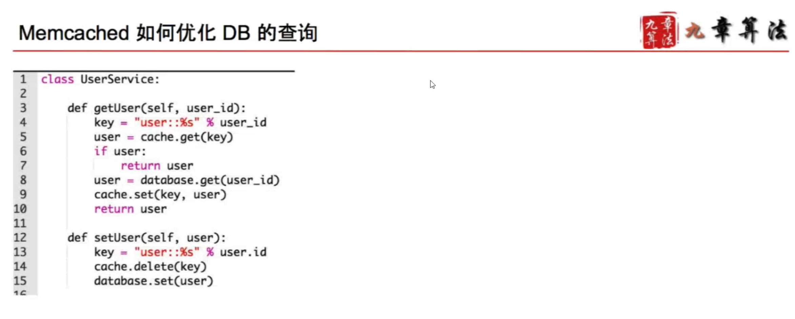

get: 如果cache有，直接返回；否则，从db中取，顺手更新cache，返回

set: 先删除cache里的对应数据，然后置db里的数据

> 原因：如果先set cache，成功，之后set db的时候万一db连接失败，那么db就没更新，db 和 cache就有了不一致。要失败，两个一起失败。不怕cache里面没有，怕cache里面有脏数据

- cache aside:

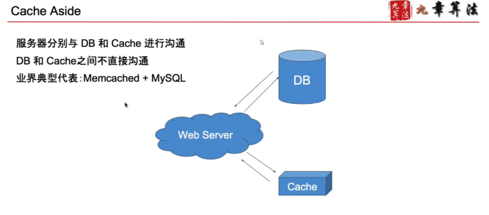

cache在旁边，意为cache和db不直接连通，而是通过webserver。这是大部分情况

- cache through:


web server 只与 cache交互。cache和db包装起来，有统一对外接口。写操作只写在cache，之后cache持久化到db

> 系统不怕avg，怕peak

- read多，write少（大部分user system）

> write少，qps角度来说，可能一台mysql就搞定了
> 
> read多，意味着可以使用memcached来进行优化（一些平台cache命中率可以达到90%以上）

- read, write 都多

> 1. 使用更多的db服务器分摊流量
> 
> 2. 使用像redis这样的读写操作都很快的cache-through型 db
> 
> (memcached是一个cache-aside型的db，client需要自己负责管理cache-miss时数据的loading)


单向好友（关注）比较好村，双向稍难存。一般使用方案一，存两条信息

> 怎么存信息，实际上取决于你想怎么取

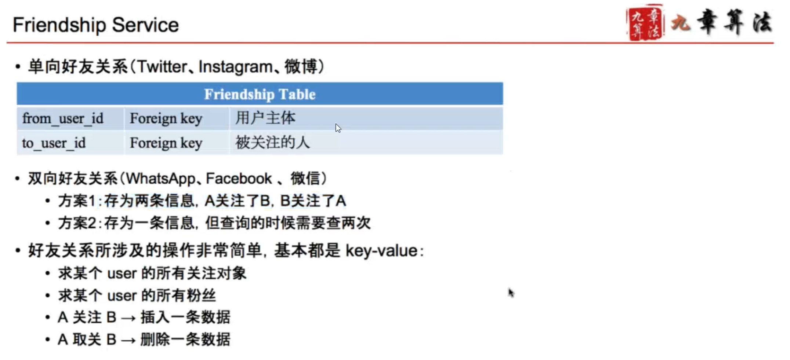

- 数据库选择原则：

1. 大部分情况下, sql / nosql 都可以
2. 需要支持 transaction， 则不能选nosql
> transaction,例如我给你打10块钱，则必须保证我的账户-10，你的账户+10，这两个事情要么都成功，要么都失败。有一个失败则需要rollback。所以可以将这两个操作打包为一个transaction执行
> transaction也只能在同一台机器，在不同的机器（例如sharding后）不能实现

3. sql更成熟，帮你做了很多事情。nosql很多东西需要你自己做（serialization, secondary index）
> - serialization: 将不同类型的data均转换为string（json就是），一般进行传输。与之对应的是deserialization
> - secondary index: 比如用户可以同时通过姓名，电话，邮箱登录，那么就需要通过多个column来搜索某个row，而不是单一的key

4. 如果想要节省服务器获得更高的性能，nosql更好。硬盘型的nosql比sql一般要快10倍以上

以Cassendra 为例剖析典型的 nosql数据结构

1. 第一层：row_key
> - 又称为hash_key
> - 用来做sharding，因为Cassendra分布式
> - 传统key-value 中的 key
> - 任何查询都需要带上这个key，无法进行range query
> - 最常用的row_key: user_id

2. 第二层：column_key
> - 是排序的（一般是树结构排序，平衡二叉树，支持范围查询），可以进行range query
> - 可以是复合值，比如timestamp + user_id 的组合

3. 第三层：value
> - 一般来说是string
> - 如果需要存很多的信息，可以自己做serialization
> - value 里面的东西就查不了了，想查，在存的时候得把它放到column_key里面

- 插入：

```
insert(row_key, column_key, value)
```
- 查询：

```
query(row_key, column_start, column_end)
```

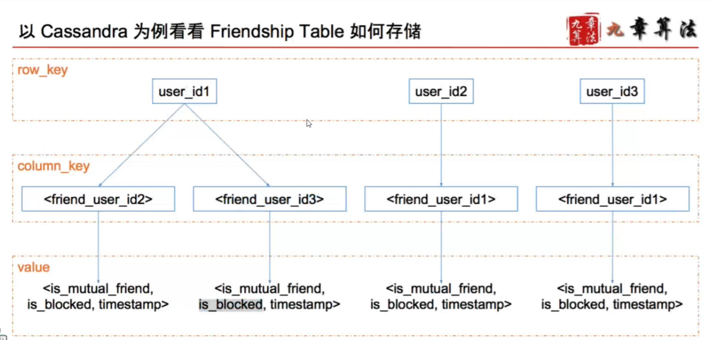

> 100M的用户存在一台mysql数据库里也存的下，storage没问题
> 
> 通过cache优化掉90%以上的读操作后，只有300qps的写，qps也没问题
> 
> 但是可能会单点失效 single point failure. 为了避免这种事情，需要：

- Sharding

> 按照一定的规则（Sharding的核心），将数据分为不同的部分，保存在不同的机器上
> 这样就算挂了也不会导致网站100%不可用

- Replica

> 通常的做法是一式三份
> 另一个好处是可以分摊读请求


### Sharding

#### Vertical Sharding

user table 放一台数据库

friendship table 放一台数据库

message table 放一台数据库

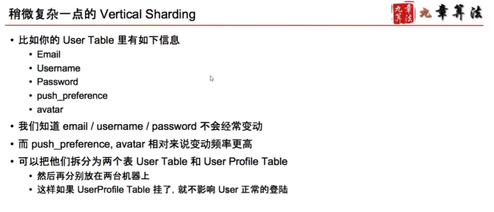

问题是，如果某张表row很多，表仍然很大就需要做：

#### Horizontal Sharding

如果我们直接采用最普通的求余hash(这就是一种不一致性hash)，例如10台机器，user_id % 10。一个小问题是不均匀，更大的问题是，如果机器不够用，我们就需要 % 11，几乎所有数据都要大范围迁移：
> 1. 慢，牵一发而动全身
> 2. 迁移期间，服务器压力增大，容易挂
> 3. 容易造成数据不一致（迁移期间用户改数据）

> 解决方案：

#### Consistent Hashing

> modulo一个很大的数，然后根据余数进行分配


每增加一台数据库，只会影响到已有的1~2台数据库，最简单的办法是，将最重的服务器load分一半到新的数据库
这样最大的问题是不均匀，以及在数据迁移期间这两台数据库压力会比较大

> 更好，更加均匀的方法：

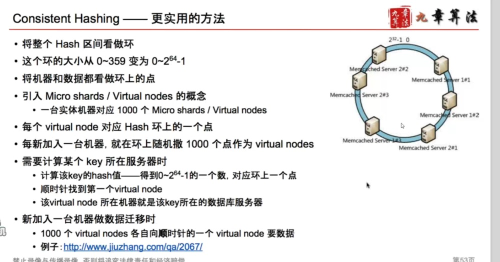

# Web Crawler & Typeahead

- web crawler: For collecting data / information from the web

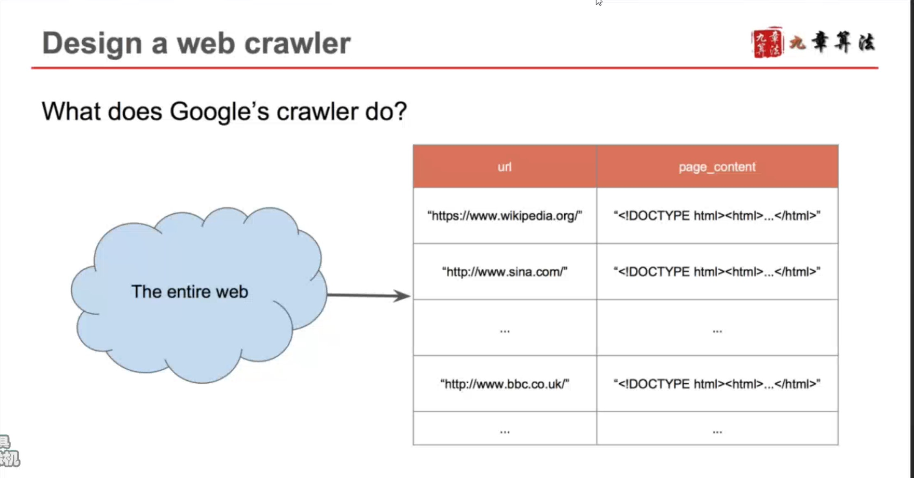

> 谷歌要存下很多url和url上的内容，然后根据用户的关键词，搜索已经存下来的内容，再返回url
> 
> 所以爬虫是搜索引擎的基础
> 
> BFS，好分布式

### scenario

> 假设网页总数1T，一周时间爬完：

10^12 / 7 / 24 / 3600 = 1.6m web pages / second

> 如果每个网页10k，需要存下来，总共需要空间：

10^16 b = 10,000T

### A simplistic news crawler

给定一个url，爬取其中的新闻标题，如何做：

1. Send an HTTP request and grab the content of the news list page
>
```
import urllib2
url = "www.samsclub.com"
request = urllib2.Request(url)
response = urllib2.urlopen(request)
page = response.read()
```


2. Extract all the news titles from the news list page
> - by regular expression
> - details are in the "inspect" after right clicking

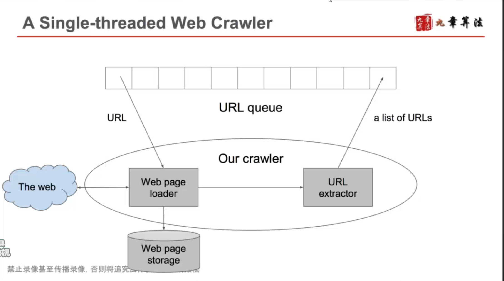

```
function run
	while (url_queue not empty):
		url = url_queue.dequeue()
		html = web_page_loader.load(url) // consume
		url_list = url_extractor.extract(html) // produce
		url_queue.enqueue_all(url_list)
	end
```

> 为什么多线程比单线程块？

- 因为 I/O wait

> DNS, firewall 会导致request到respond之间有很长时间

而多线程容易出问题的地方，是在同时访问同一个资源的时候。解决办法：

1. sleep
2. condition variable
3. semaphore

不过，线程数量也不能太多：

- context switch cost (CPU number limitation，一个CPU肯定是对多个线程)
- thread (port) number limitation (16 bits = 65536，这个数字在TCP/IP协议里面)
- network bottleneck for single machine (10Gbps， 根据前面网页content大小等数据估算出来的)
  
> - queue越往后，需要它越大，甚至可能几乎要装下全球几乎所有的网页。内存不行，需要数据库
> - queue不够灵活，只能拿到队首。也因此要用数据库

- queue -> task table

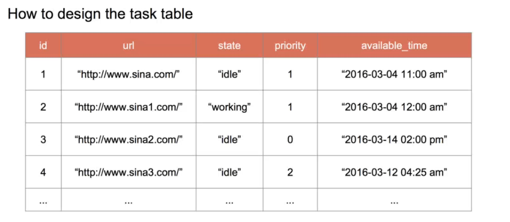

> 数据库慢，就sharding

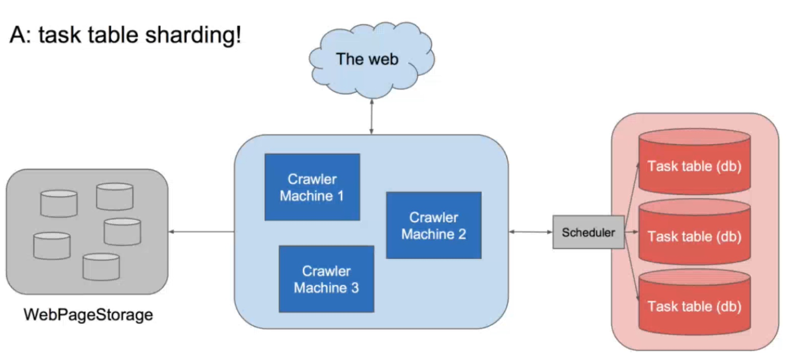

> 有的网页可能已经退役了，为了应对这种情况，可以使用：

- Exponential back-off:
> - 假如每次成功的抓取间隔是1周
> - 第一次失败，设置为2周
> - 第二次失败，设置为4周...
> 
> 同样的道理，如果爬取成功，并且发现有更新，那么可以更新时间除以2

> How to handle dead cycle?

- quota（配额）:

> 限制大平台，比如新浪，相关的网页不超过一个阈值，例如10%

### Typeahead

> google de typeahead, 估算一下：
> 
> DAU: 500m
> 
> search: 6 * 6 * 500m = 18b (假设一个人一天搜6次，平均每次打6个字母)
> 
> avg qps = 18b / 86400 = 200k
> 
> peak qps = avg qps * (2 ~ 3)

- google suggestion architecture

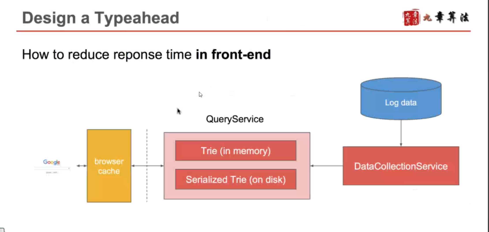

> 那么应该怎么存我们之前收集到的数据，来满足typeahead的需求？

- 直接存储出现过的高频词，和频次

> 但是这样不好，需要typeahead的时候，要用到like，非常慢

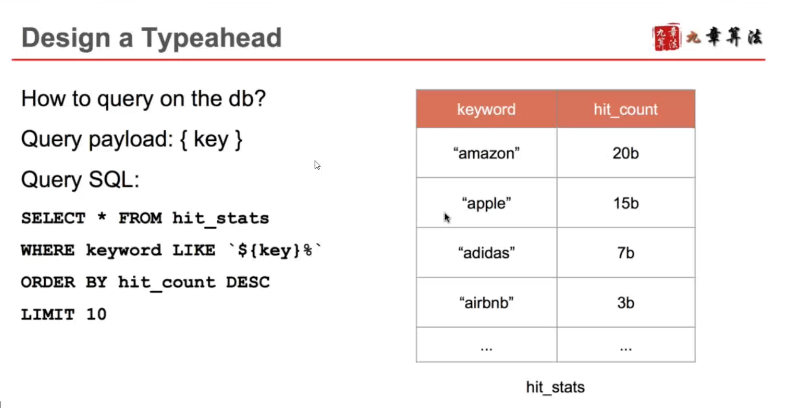

- 存成关键词前缀 + 关键词 + 频次的形式

> 定期更新高频词到表中。例如"apple"，如果它频次很高,就分别更新表中"a", "ap", "app", "appl", "apple" 对应的list

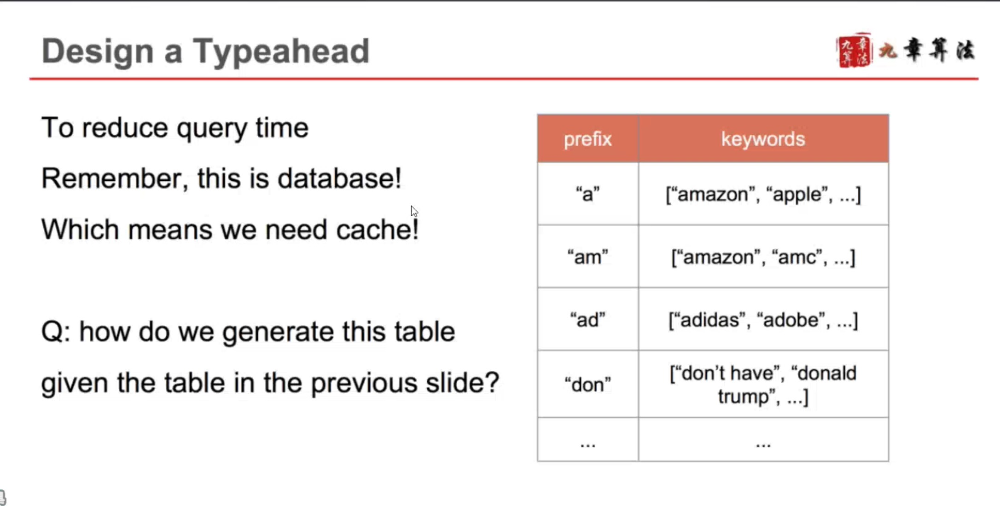 

- trie


> - 就把对应单词的频次存在最后的字母那里，相当于 isword
> - 共享prefix，节省空间
> - 但是假如有10行（就是说单词最多10个字母，其实一点也不多），我们就要遍历子树，时间为 26^10，太大了，还需要优化

- trie 每个字母后面不存以自己结尾的频次，而是存好已经输入到自己，补全的topk结果

> 更新这里没懂

> How to reduce response time in front-end(browser)?
> 
> 1. cache result(javascript 存储下搜索过的request的结果，退格的时候就可以用到)
> 
> 2. pre-fetch

可以把trie用分布式，多台机器来存

> 为了均匀，还是要用到consistent hashing
> 
> 来了一个adidas：
> 
> 先计算a的hash value，比如得到2，那么就在第二台机子上更新/拿取a对应的结果，换句话说，a的结果只在2上，其它机器a对应的结果是空的
> 
> 再计算ad，adi等等的哈希值，就不一定是2了，可能是别的机器，存在对应机器上，这样均匀
> 
> 但是这样子就牺牲了trie的共享特性

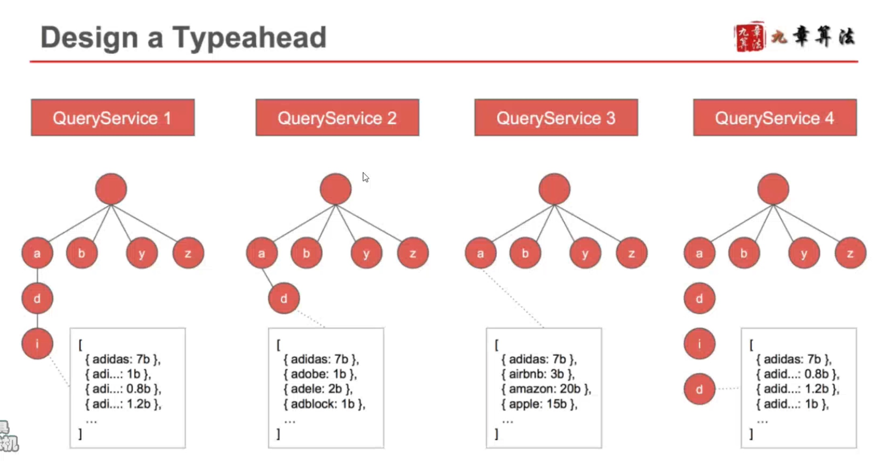 

> How to reduce the size of log file(就是存用户搜索频次记录的那个文件)

- Probabilistic logging

> 每次用户搜一个词，系统随机一个0 ~ 9999的数字，如果是0，才存入log
> 
> 也就是说，万分之一的概率存入，这样能把log file size缩小至原来的万分之一


# Distributed System

- 用多台机器去解决一台机器不能解决的问题：

> 1. 存储不够
> 2. QPS 太大

-

> - Distributed File System (Google File System)

> 怎么有效存储数据?

> N􏰀oSQL底层需要一个文件系统

> - Map Reduce􏰊􏰎􏰐

> 怎么快速处理数据?

> - Bigatble = NoSQL DataBase􏰌􏰓􏰐

> 怎么连接底层存储和上层数据

-

- 设计一个文件系统

> 协调多台机有两种模式：

1. peer to peer
> 一台机器挂了，还可以工作
> 
> 但机器台数多了以后，互相需要的连接太多

2. master & slave
> 设计简单，都只需要与master通信，一致性好保持
> 
> master挂了就凉了。但是重启就行了，最终还是选择master / slave

> 应该把一些文件的内容，比如.mp4，的内容和标题等元数据分开储存。不同文件的元数据放在一起，内容放在一起。原因是，元数据读的次数很多，放在一起好找

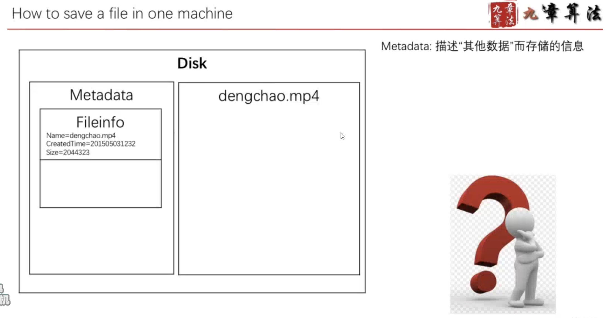 

> 在磁盘上，文件是连续存储，还是不连续
> 
- windows 连续，linux 不连续


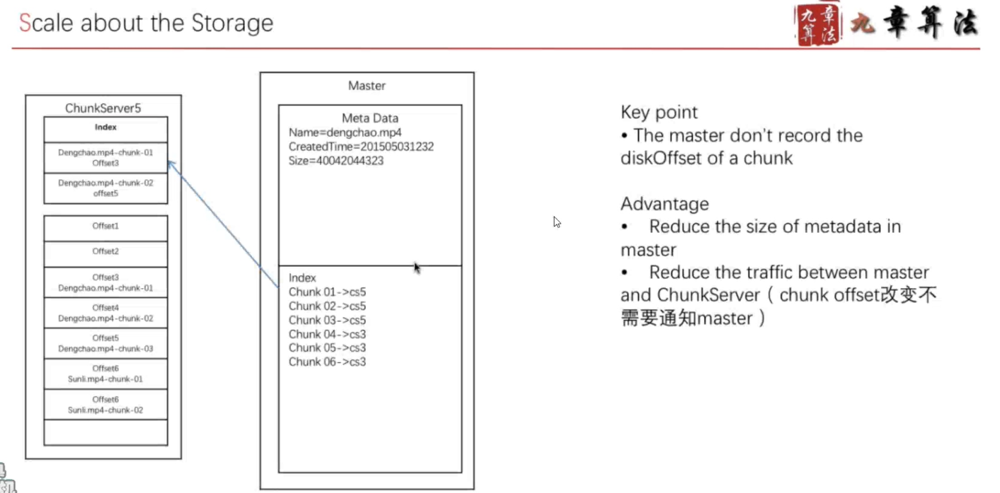

> master 存储1G的内容，大概需要1b的metadata （10^6 : 1）

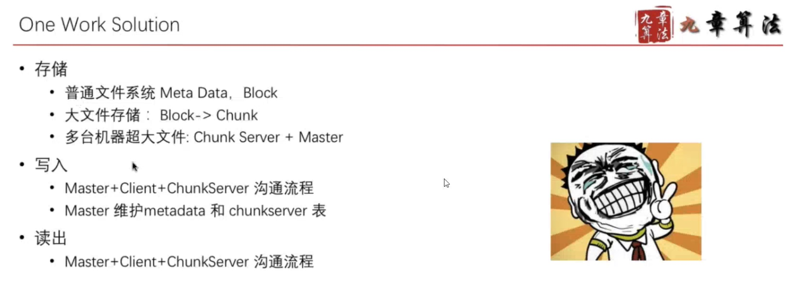

> how to identify whether a chunk on the disk is broken?

- checksum(多存一个前面多个结果的 xor)

> 一边写入数据，一边计算xor校验码，写入
> 
> 读的时候，也是一边读，一边计算xor，检查

-

> how to avoid data loss when a chunkserver is down/fail?

- replica

> how to find whether a chunkserver is down / fail?

- heart beat(chunkserver 定期给master发消息)

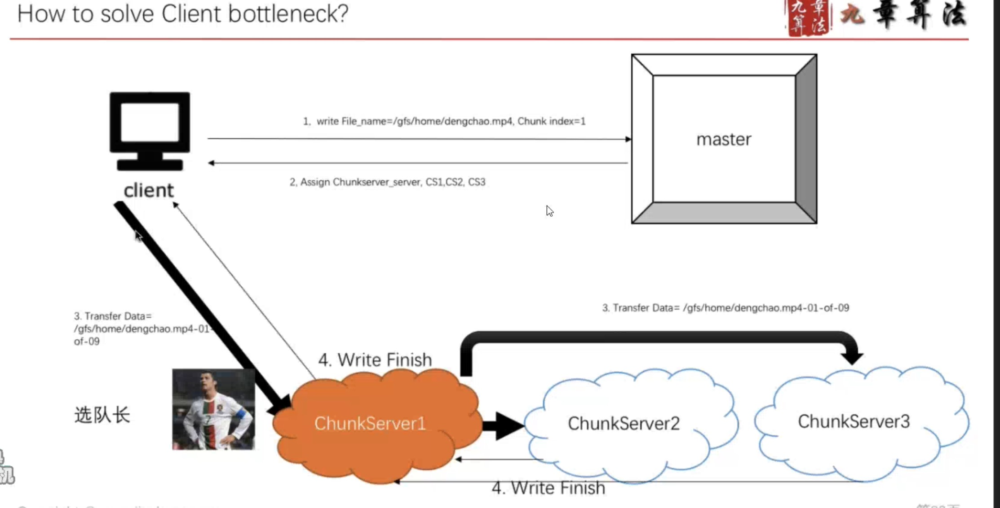

> 怎么样选择队长？
> 
> - 找近的（快）
> 
> - 找现在不干活的（平衡traffic）

-

> mysql 如何做replica?

- 通过master - slave (这里是数据库里的版本，不同于GFS)

- master:
> read / write

- slave:
> 1. only read (避免不一致)
> 2. 从master同步信息，会有滞后
> 3. 既可以做replica，也可以帮master分担读请求

- 不同的是，这里的master会存储，而GFS里master不存储，只是派活

# Web System & Design Tiny URL

> 当我输入 www.google.com 后
> 
> 首先访问理我最近的DNS服务器
> 
> - Domain Name System
> 
> - DNS 记录了 www.google.com 这个域名对应的IP地址是什么
> 
> 然后你的浏览器向该IP发送http/https请求
> 
> - 每台服务器/计算机联网都需要一个IP地址
> 
> - 通过IP地址就能找到这台服务器/计算机

- 服务器(Web Server，偏硬件)收到请求，将请求递交给正在 80 端口监听的HTTP Server（偏软件）
- 比较常用的 HTTP Server 有 Apache, Unicorn, Gunicorn, Uwsgi
- HTTP Server 将请求转发给 Web Application

> 最火的三大Web Application Framework: Django, Ruby on Rails, NodeJS

- Web Application 处理请求

1. 根据当前路径 “/”找到对应的逻辑处理模块
2. 根据用户请求参数(GET+POST)决定如何获取/存放数据
3. 从数据存储服务(数据库或者文件系统)中读取数据
4. 组织数据成一张 html 网页作为返回结果
- 浏览器得到结果，展示给用户

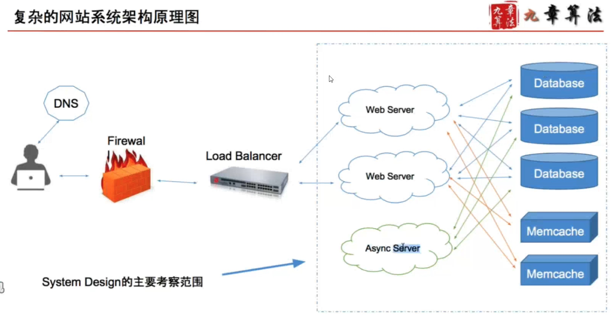

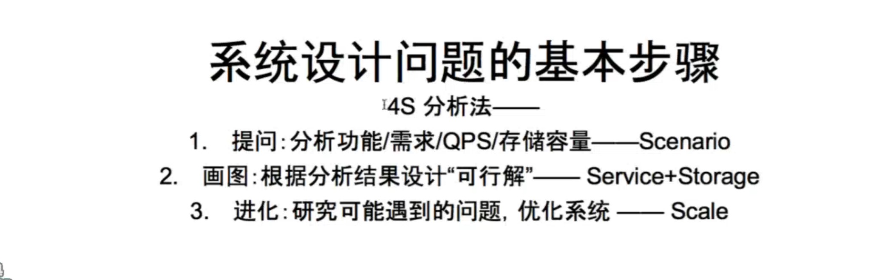

- Tiny URL

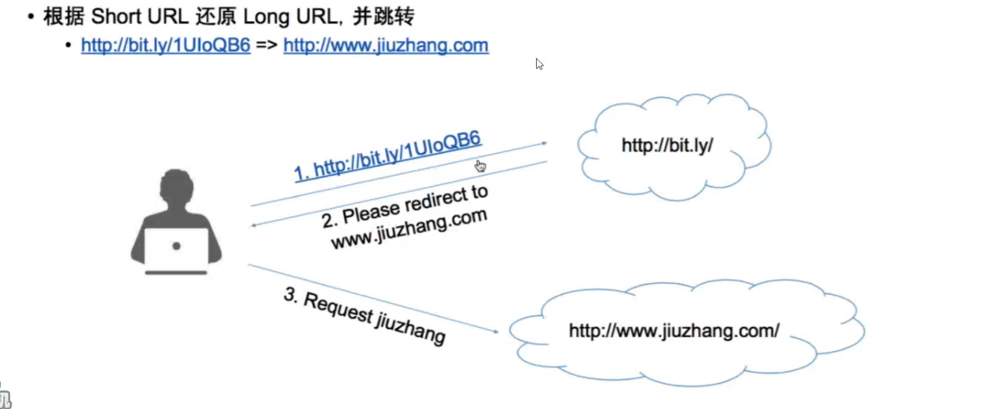

> - 右上方的服务器只是告诉回给用户，你想要的原地址是啥
> 
> - 浏览器cache可以记住这个地址，之后不用再去右上方服务器请求

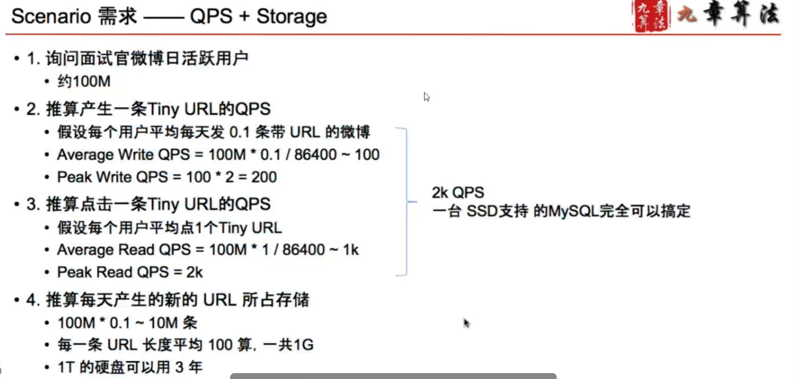

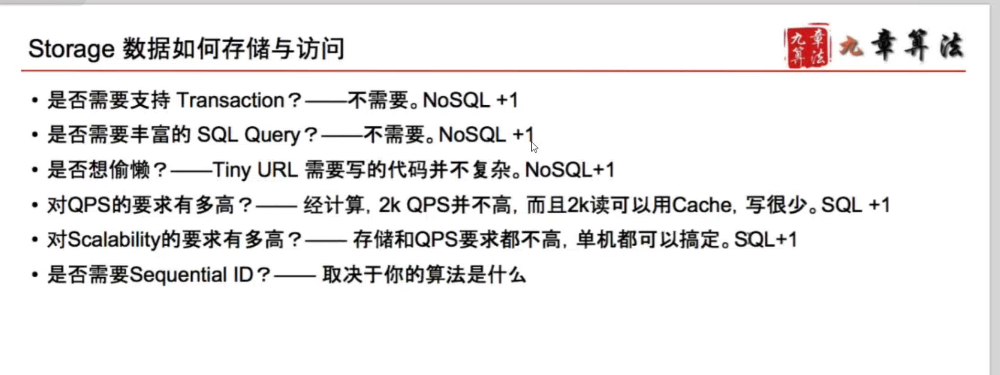

可以有两种方法生成tiny url:

1. 通过某种hashfunc，或随机生成一个
> 但是这样越往后效率越低，都被占用了
> 一般是long_url + timestamp，加上timestamp的原因是降低冲突概率

2. sequential id，用sql db

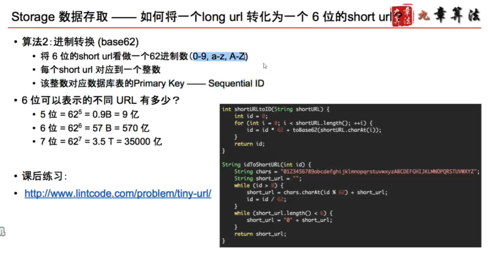

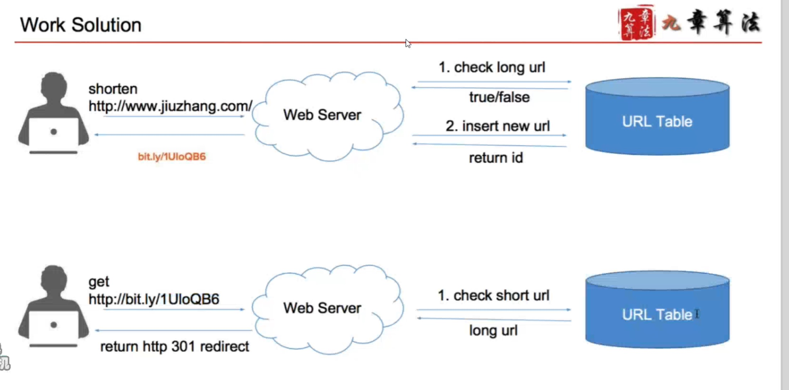

> 可以进一步优化读的响应时间

1. 通过memcached。存一部分，有的直接返回，没有的再去查数据库
2. 通过地区：

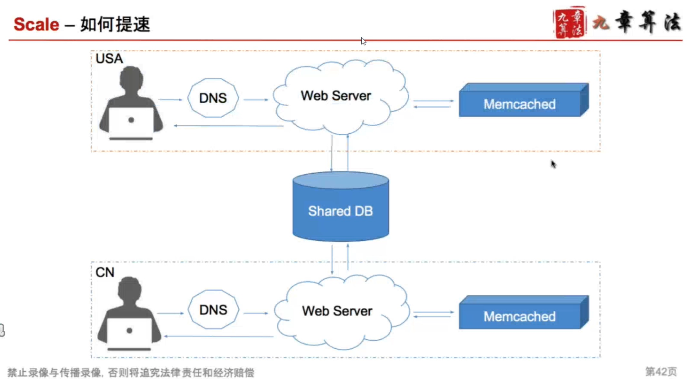

> 上图中，同一个框意味着基本在同一个地方，比较快

-

> 如果一台sql搞不定，我们可以做sharding。那么问题来了，应该选择哪个作为sharding key？ ID or long_url?

应该选择ID。因为通过ID查long_url要比通过long_url查ID的操作多很多，因此ID为sharding key就可以直接知道这条信息在哪个数据库里。反之，则需要广播通知所有数据库寻找

> 但是,sequential ID在sharding下比较难保持，可以用一台机器专门在前面负责ID。但是也不是很好，因为单点失效

> 比较好的方法是：

在short key前面加一位，这一位是sharding key。它由long_url得来(例：hash(long_url) % 62

> 这样子我们无论拿到short_url 和 long_url都不用广播，直接找到该台机器

所以最终的优化手段：

1. cache
2. 通过地区
3. sharding

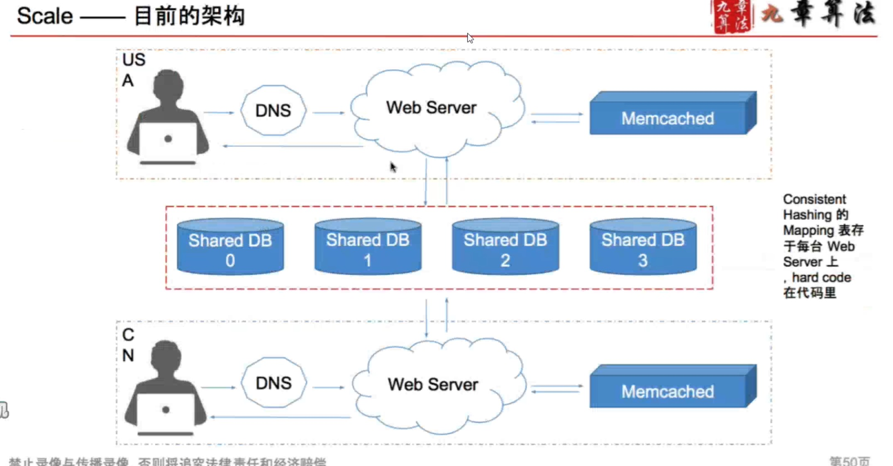

> 在这种情况下，你总得选择你的db放在哪一边。无论放在哪边，对面的用户请求都会比较慢，为了解决这种问题，可以进一步：
> 
由于不同地方的人群通常访问的网站也不同，所以我们可以将例如中美的网站分开，将youtube, google等相关url sharding到美国db，将sina, baidu等sharding到中国db

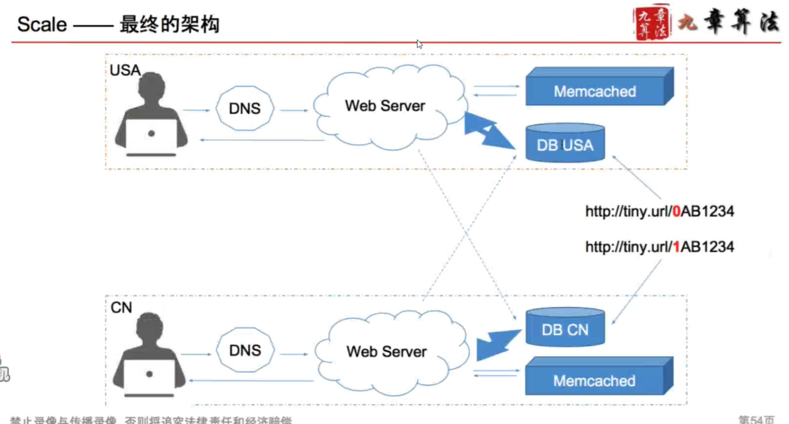

原则：我们做产品或服务，主要想怎么解决主要问题，大部分人的问题，而不是极端的例子

# Map Reduce

> 统计一篇文章的词频的时候，可以用多台机并行的方法：

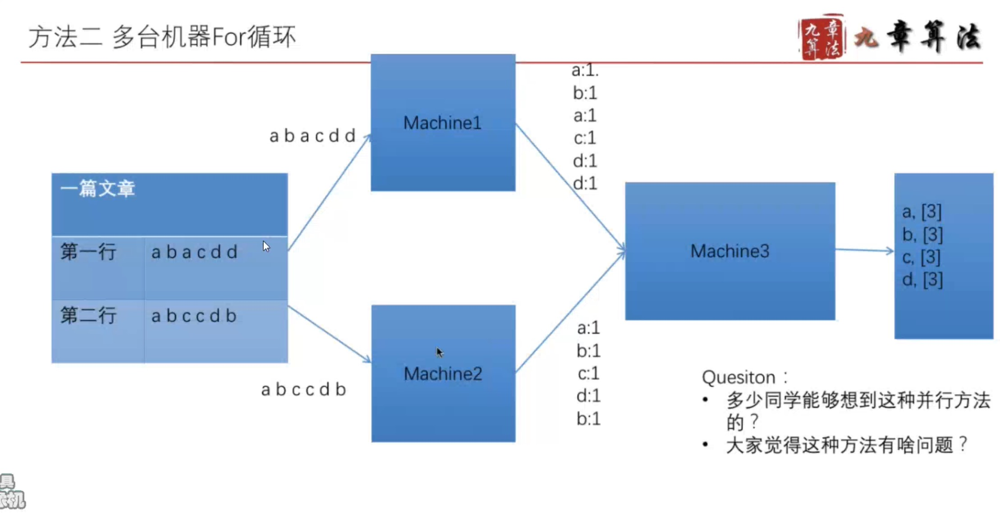

> 问题是，在合并的时候还是在同一台机做的，还是load 很重

> 用map reduce的方法

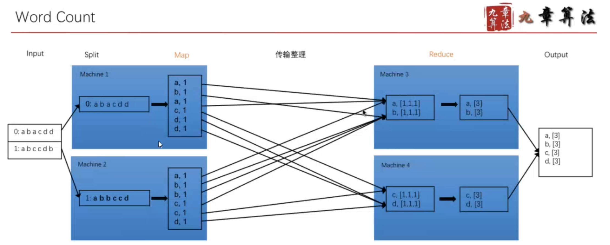

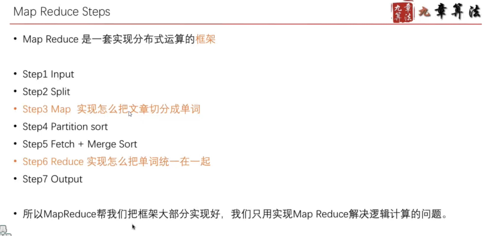

> 外排序

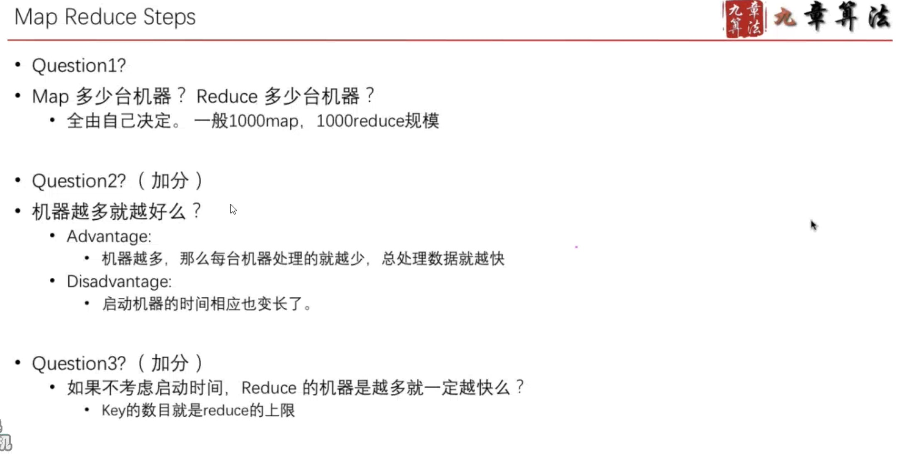

- inverted index

